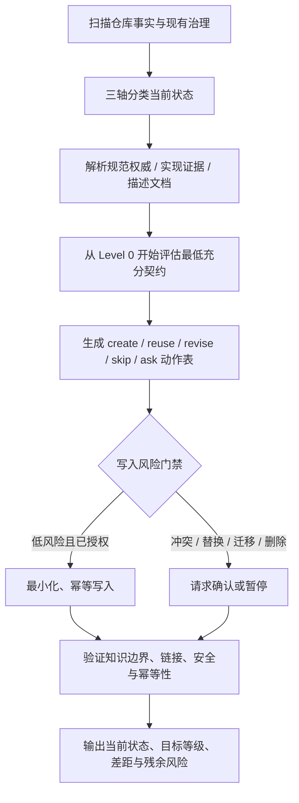

# bootstrap-project-contract

> 为代码仓库选择并建立**最低充分（lowest sufficient）Agent 治理契约**的 Skill。
>
> 它不会默认替你创建 `README.md`、`AGENTS.md`、规划文档、架构决策记录或一整套治理目录，而是先检查仓库已有事实、规范和工作方式，只在确有必要时进行最小化补充或修复。

## 简介

`bootstrap-project-contract` 用于在新项目启动、已有仓库接入 Agent，或项目治理方式需要重新评估时，回答一个核心问题：

> **这个仓库究竟需要多少 Agent 治理，而不是“最多能加多少治理文件”？**

Skill 会先扫描仓库的代码、配置、测试、文档、已有 Agent 指令、需求来源、计划系统和架构记录，然后从 **Level 0 → Level 3** 逐级判断，选择能够解决当前实际问题的最低治理等级。

它强调：

* **Evidence first**：优先相信仓库事实，而不是请求中的假设；
* **Minimum governance**：治理文件是候选项，不是必选项；
* **Reuse before create**：优先 `reuse` / `skip`，而不是创建新文件；
* **Platform independent**：核心知识模型不绑定 Codex、Claude Code、Cursor 等平台；
* **Risk-gated writes**：涉及替换、迁移、删除或冲突权威时先确认；
* **Idempotent**：立即再次运行时，不应继续制造新的治理改动。

---

## 适用场景

推荐在以下场景显式调用：

* 新仓库准备接入 AI Agent / Coding Agent；
* 已有项目没有清晰的 Agent 行为边界；
* 仓库中存在多个 `README`、Agent 指令、需求文档或计划系统，不确定谁才是事实来源；
* Agent 配置长期演进后出现重复、冲突或漂移；
* 想判断项目到底需要简单说明、结构化治理，还是正式的审批与追踪机制；
* 想为 Codex / Claude Code / Cursor 等平台建立适合当前仓库的最小契约，而不是直接套模板；
* 希望重新评估一个“治理过重”的项目，并判断哪些内容可以继续复用、哪些可以简化。

如果仓库当前已经满足最低充分契约，Skill 可以直接给出：

```text
No additional governance required
```

也就是说，**“什么都不改”本身是一个合法结果。**

---

## 核心思想

### 将“仓库现状”和“目标治理等级”分开

Skill 首先独立判断三个当前状态轴：

| 维度     | 可选状态                                               |
| ------ | -------------------------------------------------- |
| 项目成熟度  | `empty` / `prototype` / `established` / `mature`   |
| 当前治理状态 | `none` / `lightweight` / `structured` / `governed` |
| 交付模式   | `one-shot` / `iterative` / `staged` / `continuous` |

这些状态只描述**现在是什么样**，并不会直接决定**应该治理到什么程度**。

### 从 Level 0 开始逐级升级

| 等级                        | 含义                                        | 默认治理预算              |
| ------------------------- | ----------------------------------------- | ------------------- |
| **Level 0 — None**        | 不需要新增 Agent 治理                            | 不创建治理文件             |
| **Level 1 — Lightweight** | 一个持久化指令或说明即可解决问题                          | 最多新增 1–2 个简洁产物      |
| **Level 2 — Structured**  | 持续协作需要独立的规范角色、计划或作用域策略                    | 只维护确实需要的规范角色        |
| **Level 3 — Governed**    | Level 2 无法满足审计、合规、严格追踪、正式变更控制、高风险审批或多团队边界 | 每个正式治理产物都必须对应明确硬性需求 |

每次升级都必须回答：

1. 当前具体有什么问题没有解决；
2. 为什么更低一级解决不了；
3. 新增治理成本是否值得。

仓库规模、代码量、项目年龄、架构复杂度、集成数量或 Agent 使用频率，**都不能单独成为升级到 Level 3 的理由**。

---

## Repository Knowledge Model

Skill 将仓库知识分成三类。

### Normative Authorities

回答：

> **应该是什么？**

包括：

* Agent policy；
* Requirements；
* Delivery planning；
* Architecture decisions；
* Scoped policy。

每一个适用的规范角色都应该只有一个权威来源。

### Implementation Evidence

回答：

> **现在实际是什么？**

例如：

* 源代码；
* 配置；
* Manifest；
* 测试；
* 生成产物；
* 安全的运行时检查；
* 可访问的部署状态。

默认情况下，测试属于实现证据，并不会自动成为 Requirements Authority。

### Descriptive Documentation

回答：

> **如何向人解释这个仓库？**

例如：

* `README.md`；
* 运维文档；
* Onboarding 文档；
* 生成式参考页面。

README 与代码事实发生冲突时，代码、配置、测试等实现证据用于表示实际状态，README 则被视为出现了 descriptive drift。

---

## 状态标签

| 标签         | 含义                      |
| ---------- | ----------------------- |
| `verified` | 有实现证据支持                 |
| `designed` | 已由规范权威或用户明确决定，但尚未得到实现验证 |
| `unknown`  | 既没有权威依据，也没有实现证据         |

这样可以避免 Agent 为了让文档“看起来完整”而虚构测试结果、运行状态或指标。

---

## Workflow



整体可以概括为：

1. **Discover**：发现仓库知识模型；
2. **Classify**：判断成熟度、治理状态、交付模式；
3. **Resolve roles**：找出各规范角色真正的权威来源；
4. **Select level**：从 Level 0 开始选择最低充分契约；
5. **Write gate**：按风险决定直接写入、确认或阻塞；
6. **Write idempotently**：只修改必要的最小语义表面；
7. **Validate**：验证角色边界、风险、安全和幂等性。

---

## Artifact 动作模型

每个候选治理产物只能选择一个动作：

| 动作       | 含义                      |
| -------- | ----------------------- |
| `create` | 当前存在真实问题，而且没有可复用权威      |
| `reuse`  | 已有内容一致且充分               |
| `revise` | 已有权威出现漂移、冲突或无法表达当前约束    |
| `skip`   | 当前没有真实需求                |
| `ask`    | 平台、作用域、优先级或权威冲突无法仅凭证据确定 |

每一个非 `skip` 操作都必须对应一个明确的当前问题。

这就是 Skill 的 **governance budget** 思想。

---

## 写入安全策略

满足以下条件时可以直接写入：

* 用户已经明确要求本次操作；
* 写入范围清晰；
* 操作属于低风险；
* 不存在规范权威冲突；
* 不会替换现有 source of truth；
* 修改属于新增或边界明确的修复。

以下情况需要确认：

* 大幅修改已有规范权威；
* 删除、迁移或降级已有治理产物；
* 多个规范权威互相冲突；
* 引入仓库此前没有选择的平台约定；
* 关键未知信息会改变目标等级或知识角色映射。

---

## 平台适配

核心知识模型保持平台无关。

只有仓库已经采用某个平台约定，或者用户明确选择平台时，才加载平台适配规则。

| 平台 / 模式     | Agent 指令示例                 | Scoped 指令示例                         | Reusable capabilities                   |
| ----------- | -------------------------- | ----------------------------------- | --------------------------------------- |
| Generic     | 仓库已有 instruction 文档        | 已有目录级约定                             | scripts / docs / 外部 capability registry |
| Codex       | `AGENTS.md`                | `.codex/rules/`                     | `.codex/skills/`                        |
| Claude Code | `CLAUDE.md`                | Claude-compatible scoped convention | Claude-compatible capabilities          |
| Cursor      | Cursor instruction / rules | Cursor scoped rules                 | Cursor capability mechanism             |

这些路径是**检测和适配参考**，不是创建要求。

Skill 不会因为检测到一个熟悉的文件名，就自动推断整个仓库的平台。

---

## 安装

项目目录需要保持完整：

```text
bootstrap-project-contract/
├── SKILL.md
├── agents/
│   └── openai.yaml
└── references/
    ├── decision-matrix.md
    ├── file-contracts.md
    ├── optional-dependencies.md
    ├── platform-adapters.md
    └── validation-checklist.md
```

将整个目录放入你的 Agent / Skill 运行环境能够发现的 Skill 路径即可。

例如，在已经明确采用 Codex repository-local Skills 约定的仓库中，可以放到：

```text
.codex/skills/bootstrap-project-contract/
```

不同 Agent 平台的 Skill 搜索路径可能不同，应以实际平台配置为准。

---

## 用法

### 显式调用

`agents/openai.yaml` 配置为：

```yaml
policy:
  allow_implicit_invocation: false
```

因此本 Skill 设计为**显式调用**。

默认提示词：

```text
Use $bootstrap-project-contract to select and establish the lowest sufficient Agent contract for this repository.
```

### 新项目初始化

```text
Use $bootstrap-project-contract to inspect this new repository and establish the minimum Agent governance it actually needs.
```

它会：

* 判断当前项目成熟度；
* 检查是否真的需要 Agent policy / README；
* 从 Level 0 开始评估；
* 如果默认 Agent 行为已经足够，则不创建治理文件。

### 已有项目重新评估

```text
Use $bootstrap-project-contract to reassess this repository's current governance, identify the source-of-truth files, and add only the missing Agent contract pieces.
```

它会：

* 扫描代码、配置、测试和文档；
* 找出规范权威、实现证据和描述文档；
* 识别 conflict / drift；
* 输出最小 `create / reuse / revise / skip / ask` 方案；
* 只修改已经授权且风险明确的内容。

### 检查是否治理过度

```text
Use $bootstrap-project-contract to determine whether this repository is over-governed. Recommend the lowest sufficient target contract and do not delete or migrate existing authorities without confirmation.
```

当前治理状态完全可以高于目标等级。

Skill 可以推荐简化，但不会未经确认就删除、迁移或降级已有权威。

## 为什么它不是普通项目初始化模板？

传统 bootstrap 通常直接生成：

```text
README.md
AGENTS.md
specs/
plans/
decisions/
rules/
...
```

`bootstrap-project-contract` 的逻辑恰恰相反：

1. 先证明存在真实问题；
2. 再证明现有权威解决不了；
3. 再证明更低治理等级不够；
4. 最后才创建最低必要产物。

因此它更像一个：

> **Agent Governance Decision Engine**

而不是文件脚手架。

---

## 设计原则

可以用一句话概括：

> **Govern the repository only as much as the evidence requires.**

即：

* 不把最佳实践变成无条件模板；
* 不把“可以创建”误认为“应该创建”；
* 不复制已经存在的 source of truth；
* 不为了平台适配破坏仓库原有结构；
* 不为了文档完整性伪造实现事实；
* 不因为项目“大、久、复杂”就直接升级治理；
* 不在没有明确授权时执行破坏性迁移；
* 能 `reuse` 就不 `revise`；
* 能 `skip` 就不 `create`。